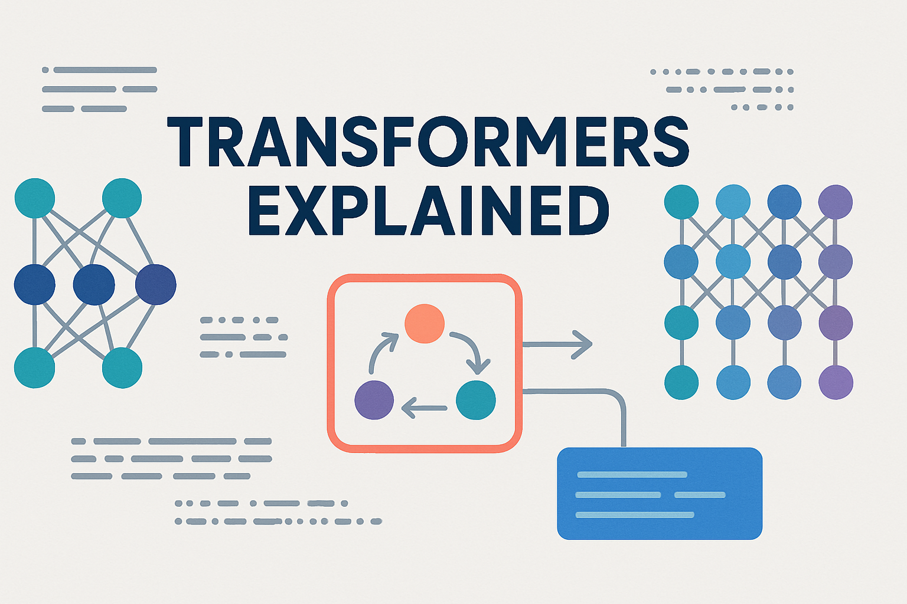

# Transformers Explained

Bienvenue dans le dépôt "Transformers Explained" ! Ce projet vise à démystifier l'architecture des Transformers, un modèle révolutionnaire qui a transformé le domaine du traitement du langage naturel (TLN) et au-delà.

Que vous soyez un débutant curieux ou un praticien expérimenté cherchant à approfondir vos connaissances, ce dépôt fournit une approche complète et pratique pour comprendre les Transformers. Nous explorerons les concepts fondamentaux, le mécanisme d'attention, et même construirons un Transformer à partir de zéro.

## Table des matières

- [Introduction aux Transformers](#introduction-aux-transformers)
- [Le mécanisme d'attention](#le-mécanisme-datention)
- [Construire un Transformer à partir de zéro](#construire-un-transformer-à-partir-de-zéro)
- [Fine-tuning des Transformers](#fine-tuning-des-transformers)
- [Installation](#installation)
- [Utilisation](#utilisation)
- [Structure du projet](#structure-du-projet)
- [Contribuer](#contribuer)
- [Licence](#licence)

## Introduction aux Transformers

Cette section fournira une vue d'ensemble de l'architecture des Transformers, de leur histoire et de leur importance dans le domaine du TLN. Nous aborderons les concepts clés tels que l'encodage positionnel, les blocs d'encodeur et de décodeur, et la façon dont les Transformers ont surmonté les limites des modèles récurrents et convolutionnels.

## Le mécanisme d'attention

Au cœur des Transformers se trouve le mécanisme d'attention, en particulier l'auto-attention (self-attention). Cette section expliquera en détail comment l'attention permet au modèle de pondérer différentes parties de la séquence d'entrée lors de la prédiction, capturant ainsi les dépendances à longue portée.

## Construire un Transformer à partir de zéro

Pour une compréhension approfondie, nous construirons un Transformer simplifié en utilisant des bibliothèques populaires de deep learning. Cette approche pratique vous aidera à saisir les subtilités de chaque composant et leur interaction.

## Fine-tuning des Transformers

Les modèles de Transformers pré-entraînés sont devenus la norme dans de nombreuses tâches de TLN. Cette section couvrira les techniques de fine-tuning, montrant comment adapter ces modèles puissants à des tâches spécifiques avec des ensembles de données plus petits.

## Installation

Des instructions détaillées sur la configuration de votre environnement de développement et l'installation des dépendances nécessaires.

## Utilisation

Comment exécuter les notebooks Jupyter et explorer les exemples de code.

## Structure du projet

```
transformers-explained/
├── notebooks/
│   ├── 01_introduction_to_transformers.ipynb
│   ├── 02_attention_mechanism_explained.ipynb
│   ├── 03_building_a_transformer_from_scratch.ipynb
│   └── 04_fine_tuning_transformers.ipynb
├── assets/
│   └── # Images et autres médias
├── data/
│   └── # Jeux de données
├── README.md
├── requirements.txt
├── LICENSE
└── .gitignore
```

## Contribuer

Nous encourageons les contributions ! Veuillez consulter le fichier `CONTRIBUTING.md` (à venir) pour plus de détails.

## Licence

Ce projet est sous licence MIT. Voir le fichier `LICENSE` pour plus de détails.





[](https://opensource.org/licenses/MIT)
[](https://jupyter.org/)


